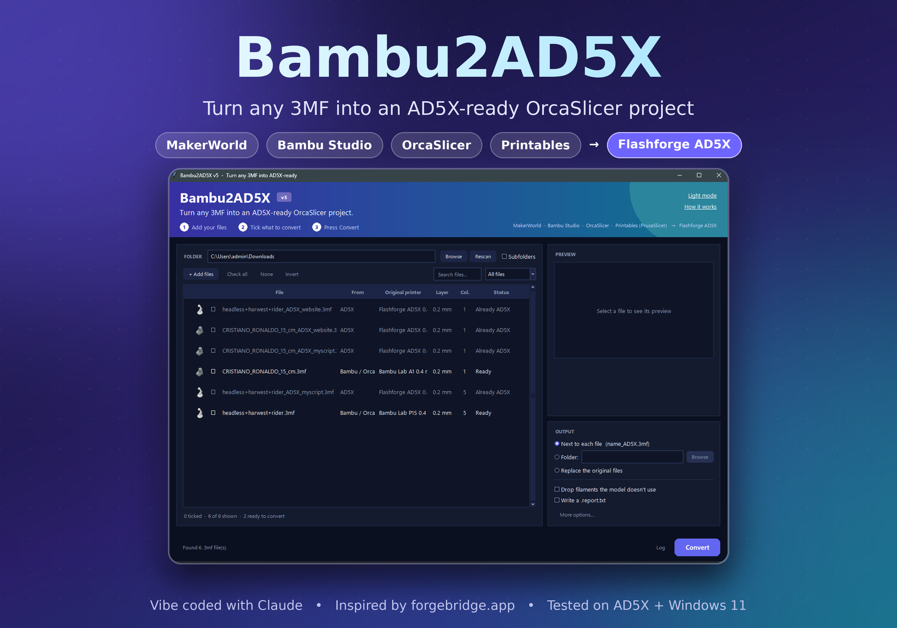
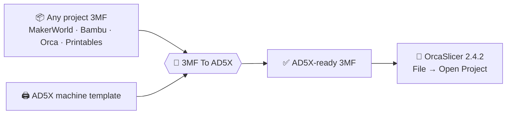

<div align="center">



<br><br>

# 🖨️ 3MF To AD5X

**Drop in any 3MF. Get an AD5X-ready OrcaSlicer project. Keep the author's settings.**

<br>

[](https://github.com/iChristGit/3MF-to-AD5X/releases/download/v1.0.0/3MF-To-AD5X.exe)
[](https://github.com/iChristGit/3MF-to-AD5X/issues)
[](https://github.com/iChristGit/3MF-to-AD5X/pulls)


<br>

[**Download**](#-download) · [**Quick start**](#-quick-start) · [**Sources**](#-supported-sources) · [**Features**](#-features) · [**Command line**](#-command-line) · [**How it works**](#-how-it-works) · [**Contribute**](#-contributing)

</div>

<br>

> [!IMPORTANT]
> **Tested on the Flashforge AD5X + Windows 11 only.** Linux, macOS and other Flashforge machines are untested and **contributors are very welcome**. If you find a bug, or a value that doesn't match the author's original settings or what the AD5X really does, please [open an issue](https://github.com/iChristGit/3MF-to-AD5X/issues) or send a PR.

---

## ✨ Why?

You found a great model on **MakerWorld** or **Printables**, but the project was made for another printer. Open it in OrcaSlicer with an AD5X and you get the wrong machine profile, wrong G-code, wrong speeds, and the author's carefully tuned settings quietly replaced by defaults.

| | ❌ Opening the raw 3MF | ✅ After 3MF To AD5X |
|---|---|---|
| **Printer profile** | Bambu / Prusa machine | Flashforge AD5X 0.4 nozzle |
| **Start / end G-code** | Wrong printer | AD5X G-code |
| **Speeds** | Made for another printer | AD5X speeds, matched to the layer height |
| **Author's settings** | Silently swapped for defaults | Kept (walls, infill, supports, seam, brim, ...) |
| **Filament preset** | Unknown / missing | AD5X preset by material (PLA → PLA Basic, ...) |
| **Unused filaments** | Clutter | Removed and renumbered |

---

## 📥 Download

<div align="center">

### [⬇ Get the latest version](https://github.com/iChristGit/3MF-to-AD5X/releases/latest)

Single file · no install · no Python needed · just double-click

</div>

Prefer to build it yourself? Jump to [Build from source](#-build-from-source).

---

## 🚀 Quick start

<table>
<tr>
<td align="center" width="20%"><h3>1️⃣</h3><b>Add</b><br>files or drag & drop folders</td>
<td align="center" width="20%"><h3>2️⃣</h3><b>Tick</b><br>what to convert</td>
<td align="center" width="20%"><h3>3️⃣</h3><b>Choose</b><br>where the output goes</td>
<td align="center" width="20%"><h3>4️⃣</h3><b>Convert</b><br>one click</td>
<td align="center" width="20%"><h3>5️⃣</h3><b>Open</b><br>in OrcaSlicer</td>
</tr>
</table>

> [!WARNING]
> In OrcaSlicer 2.4.2 open the result with **`File → Open Project`**. **Do not drag it into the window**, or the project profile may not load correctly.



---

## 🧩 Supported sources

| Source | How to get the file | |
|---|---|:-:|
| **MakerWorld** | Download the *print profile* 3MF | ✅ |
| **Bambu Studio** | Saved `.3mf` project | ✅ |
| **OrcaSlicer** | Saved `.3mf` project | ✅ |
| **Printables** | Open the model → **Download** the project the designer saved in PrusaSlicer | ✅ |
| Creality Cloud, Snapmaker Space, makeronline, Meshy … | Any Bambu/Orca-style project 3MF | 🟡 should work |

> [!NOTE]
> A plain mesh-only 3MF (no slicer project inside) has no settings to carry over. The geometry still works, but there is nothing to preserve.

---

## 🎛 Features

<table>
<tr>
<td width="50%" valign="top">

### 🖥 Modern GUI
- Gradient header, cards, **light + dark mode**
- **Live preview** with source, layer height, filaments + material
- File list with **thumbnails**, sorting, **search** and filters
- **Drag & drop** files and whole folders
- Right-click menu, log panel, progress bar
- Big folders load in the background
- Remembers window size and settings

</td>
<td width="50%" valign="top">

### ⚙ Conversion engine
- Rebuilds `different_settings_to_system` so Orca **keeps the author's values**
- **AD5X speeds** matched to the layer height
- **Drops unused filaments**, renumbers everything
- **Prime tower** follows the model, overlap warning
- Model centred by its **real bounding box**
- Temperatures capped to AD5X limits
- Geometry, paint, supports and seams are **never touched**

</td>
</tr>
</table>

<details>
<summary><b>⌨ Keyboard shortcuts</b></summary>

<br>

| Shortcut | Action |
|---|---|
| `Ctrl+O` | Add files |
| `Ctrl+A` | Check all shown |
| `Ctrl+Enter` | Convert |
| `F5` | Rescan |
| `Ctrl+F` | Search |
| `Ctrl+L` | Toggle log |
| `Space` | Tick / untick |
| `Del` | Remove from list |

</details>

---

## 🛠 Build from source

You need **Windows** (tested on Windows 11) and **Python 3.8+** ([python.org](https://www.python.org/downloads/), tick *"Add python.exe to PATH"*).

```bat
git clone https://github.com/iChristGit/3MF-to-AD5X.git
cd 3MF-to-AD5X
build_exe.bat
```

`build_exe.bat` installs PyInstaller and the optional extras, builds in about a minute, and leaves **`3MF-To-AD5X.exe`** in the folder. Copy that one file anywhere.

Just want to run it without building? Use `run_gui.bat`.

<details>
<summary><b>Optional extras</b> (auto-detected, the app works without them)</summary>

<br>

| Package | Gives you |
|---|---|
| `pillow` | Smooth, larger previews and row thumbnails |
| `tkinterdnd2` | Drag & drop |

```bat
pip install pillow tkinterdnd2
```

</details>

---

## 💻 Command line

No GUI needed. The engine uses only the Python standard library.

```bash
python bambu2ad5x.py model.3mf                        # -> model_AD5X.3mf
python bambu2ad5x.py *.3mf                            # batch convert
python bambu2ad5x.py model.3mf -o out.3mf             # custom output (single input)
python bambu2ad5x.py model.3mf --overwrite            # replace the original (safe swap)
python bambu2ad5x.py model.3mf --keep-unused-filaments
python bambu2ad5x.py model.3mf --template my_ad5x_project.3mf
```

<details>
<summary><b>All options</b></summary>

<br>

| Option | Description |
|---|---|
| `-o, --output` | Output file (single input only) |
| `--template` | Use your own AD5X project as the machine template |
| `--report` | Write a `.report.txt` next to the output |
| `--overwrite` | Replace the original. Built in a temp file and swapped in only on success, so a failure never damages your file |
| `--keep-unused-filaments` | Don't remove filaments the model doesn't use |

</details>

---

## 🔬 How it works

OrcaSlicer loads a project's print / filament / printer preset **by name**. For every key that is *not* listed in `different_settings_to_system`, it silently swaps in the installed system preset's value, so the author's tuning gets lost.

3MF To AD5X:

1. Takes the **machine half** (printer profile, G-code, limits, build area) from a bundled **AD5X template** (`ad5x_template.json`).
2. Copies the **author's half** (layers, walls, infill, supports, seam, brim, ironing, fuzzy skin, prime tower, temperatures, colours, painting).
3. Rebuilds `different_settings_to_system` so Orca **keeps** those values.
4. Replaces speeds with AD5X-appropriate ones, removes unused filaments, repositions the prime tower.
5. Writes a new `.3mf` and leaves the geometry untouched.

<details>
<summary><b>Speeds by layer height</b></summary>

<br>

| Layer | Sparse infill | Internal solid | Gap infill |
|---|---|---|---|
| 0.16 mm | 330 | 300 | 200 |
| 0.20 mm | 270 | 250 | 200 |
| 0.24 mm | 230 | 230 | 180 |

Heights in between are interpolated. Outside 0.16–0.24 the nearest preset is used and a note is added.

</details>

<details>
<summary><b>Printables / PrusaSlicer files</b></summary>

<br>

Settings are mapped to Orca names (walls, infill, supports, seam, brim, ironing, temps, bed temps, colours, per-object/part extruders, painted colours/supports/seam). Modifier and support-blocker volumes are skipped and reported.

</details>

---

## 🧵 Other Flashforge machines

Built and tested for the **AD5X** only. Other Flashforge printers should work as a starting point, but bed size, limits and G-code may differ. To target a different machine, save an empty project for it in OrcaSlicer and pass it with `--template my_project.3mf`. Please report how it goes in the [Issues](https://github.com/iChristGit/3MF-to-AD5X/issues) tab.

---

## ❓ Troubleshooting

<details>
<summary><b>Show common problems</b></summary>

<br>

| Problem | Fix |
|---|---|
| Result looks wrong when dragged into Orca | Use **File → Open Project** instead |
| "Replace original" fails | Close the file in OrcaSlicer first |
| No drag & drop | `pip install tkinterdnd2` and rebuild |
| Blurry / no thumbnails | `pip install pillow` and rebuild |
| Build says Python not found | Reinstall Python with *Add to PATH* ticked |
| Windows SmartScreen warns about the exe | It's an unsigned PyInstaller build. Build it yourself from source if you prefer |

</details>

---

## 🤝 Contributing

This is a community project and it needs more eyes and more test files. Contributions of any size are welcome.

| | How you can help |
|---|---|
| 🧪 | **Test more files** from different sources and check the result in OrcaSlicer 2.4.2 |
| 🔍 | **Verify values** against the author's original *and* real AD5X behaviour (speeds, temps, G-code, flush volumes, prime tower) |
| 🐧 | **Linux / macOS**: testing, fixes, `build.sh`, AppImage, macOS build |
| 🖨️ | **Other Flashforge printers**: templates and test results |
| 🌍 | **Docs & translations** |

<details>
<summary><b>What to include in an issue</b></summary>

<br>

1. Where the 3MF came from (MakerWorld, Printables, …) and a link if possible
2. Your OS and Python version (or that you used the exe)
3. What you expected vs what happened
4. The generated `.report.txt` and the log output

**Pull requests:** keep the engine (`bambu2ad5x.py`) dependency-free and mention which printer / OS / files you tested with.

</details>

<details>
<summary><b>Project structure</b></summary>

<br>

```
3MF-to-AD5X/
├── docs/
│   ├── hero.png           # README banner
│   └── screenshot.png     # app screenshot
├── bambu2ad5x.py          # conversion engine (stdlib only) + CLI
├── bambu2ad5x_gui.py      # Tkinter GUI
├── ad5x_template.json     # AD5X 0.4 nozzle machine template
├── build_exe.bat          # builds 3MF-To-AD5X.exe with PyInstaller
├── run_gui.bat            # runs the GUI without building
├── LICENSE
└── README.md
```

</details>

---

## 🙏 Credits

- 🌐 **[ForgeBridge](https://forgebridge.app)** — the website that inspired this project, and it can convert files online too. Go check it out!
- 🧡 **[OrcaSlicer](https://github.com/SoftFever/OrcaSlicer)** for the slicer and its open Flashforge profiles.
- 🤖 Vibe coded with [Claude](https://claude.ai).

## ⚖ License & disclaimer

Released under the [MIT License](LICENSE).

This is an unofficial community tool, not affiliated with Flashforge, Bambu Lab, Prusa, OrcaSlicer or ForgeBridge. Converted profiles are a best effort: **always check the result in the slicer preview** before printing, and keep a backup of your originals (especially with *Replace originals*). Use at your own risk.

<div align="center">

<br>

**If this saved you time, drop a ⭐ on the repo!**

</div>
